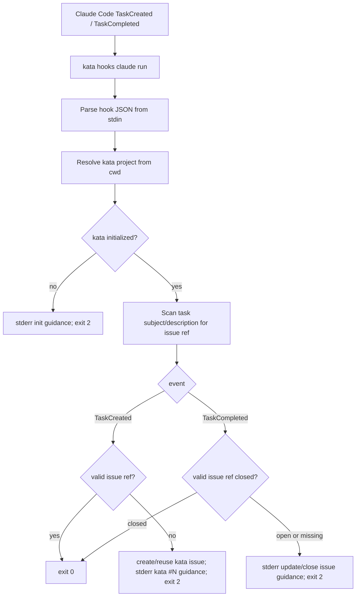

# Claude Code Hooks Integration

> **Status:** design / spec. Companion to `docs/superpowers/specs/2026-04-29-kata-design.md` (master design) and `docs/superpowers/specs/2026-04-30-kata-hooks-design.md` (kata's own post-commit hook dispatcher). This spec designs a Claude Code integration surface: installing Claude Code `TaskCreated` and `TaskCompleted` hooks that steer Claude toward kata issues.

## 1. Goal

Add a kata utility CLI command that configures Claude Code hooks, plus a stable runtime command for those hooks to call.

Claude Code's task lifecycle can currently drift away from kata: Claude may create and complete internal tasks while the durable project issue trail remains empty. The integration should make Claude's task lifecycle use kata as the durable source of truth without silently initializing or mutating the wrong project namespace.

The key behavior is feedback, not automation-at-all-costs:

- On `TaskCreated`, if a task should be tracked in kata, the hook creates or finds the kata issue itself, then blocks the Claude task creation with exit code `2` and tells Claude which `kata #N` to use instead.
- On `TaskCompleted`, the hook can block completion with exit code `2` and tell Claude to update, comment on, or close the corresponding kata issue first.
- If kata has not been initialized for the workspace, the hook should notify Claude that the user needs to run `kata init`; it must not run `kata init` automatically.

Claude Code's hook reference documents that command hooks receive event JSON on stdin. `TaskCreated` and `TaskCompleted` do not support matchers, always fire, and both treat exit code `2` as a blocking feedback path where stderr is fed back to Claude.

**Claude schema source:** this design is pinned to the Claude Code hooks reference fetched on 2026-05-05 from `https://code.claude.com/docs/en/hooks#taskcreated`. The implementation plan must add fixtures copied from that documentation for both task events and treat fixture drift as an explicit design update, not an incidental test tweak.

## 2. Non-goals

- Do not add or change kata's `$KATA_HOME/hooks.toml` dispatcher. That dispatcher observes kata events after commit; this feature configures Claude Code lifecycle hooks before Claude task state changes.
- Do not auto-run `kata init`.
- Do not invent a project identity from Claude hook input. Project resolution continues to go through kata's existing cwd / `.kata.toml` / alias rules.
- Do not use Claude Code `task_id` for correlation, idempotency, diagnostics, or mapping. It is Claude's internal task identity, not kata's durable work identity.
- Do not add a persistent Claude task to kata issue mapping store in v1.
- Do not require `jq`, shell scripts, or generated hook files for the runtime behavior.
- Do not parse Claude transcripts in v1. The hook JSON contains enough data for the first pass.

## 3. CLI surface

Add a new top-level `hooks` namespace with a provider-specific Claude subcommand:

```text
kata hooks claude install --scope local [--force]
kata hooks claude install --scope global [--force]
kata hooks claude run
```

This makes `kata hooks` the home for external automation integrations, while `claude` names the concrete provider. The existing kata hook runtime remains internal plus `kata daemon logs --hooks`; there is no pre-existing top-level `kata hooks` command to preserve.

### 3.1 `kata hooks claude install`

Installs command hooks into Claude Code settings JSON.

Flags:

- `--scope local`: install into the current workspace's `.claude/settings.local.json`.
- `--scope global`: install into `~/.claude/settings.json`.
- `--force`: replace existing kata-managed Claude hook handlers if their command shape changed or if the installed executable path differs from the current `kata` binary.

The command should require exactly one scope. If no scope is provided, return a usage error. The default is deliberately explicit because global installation affects every Claude Code project.

For local install, the target workspace is resolved from `--workspace` or cwd. The command creates `<workspace>/.claude/` if needed, but it does not require `kata init`; installation is just Claude settings wiring. Runtime hook evaluation is where project initialization matters.

For global install, the command writes `~/.claude/settings.json`.

The installer resolves the current kata executable with `os.Executable`, makes it absolute, and prefers the symlink-resolved path when possible. If the executable path cannot be resolved or does not exist, installation fails with a validation error. The installed Claude command uses that absolute executable path, quoted for shell safety, so Claude Code does not need `kata` on `PATH`.

### 3.2 `kata hooks claude run`

Reads one Claude hook event JSON object from stdin, evaluates it, and exits according to Claude Code's command hook contract.

This command is intended to be called by Claude Code, but it remains runnable by tests and users:

```text
cat fixture.json | kata hooks claude run
```

It should not print routine success output. On blocking feedback, it writes a concise Claude-facing instruction to stderr and exits `2`.

## 4. Claude settings shape

The installer merges into the existing top-level `hooks` object, preserving unrelated settings and unrelated hook handlers.

Installed shape:

```json
{
  "hooks": {
    "TaskCreated": [
      {
        "hooks": [
          {
            "type": "command",
            "command": "\"/absolute/path/to/kata\" hooks claude run",
            "timeout": 10,
            "statusMessage": "kata Claude hook"
          }
        ]
      }
    ],
    "TaskCompleted": [
      {
        "hooks": [
          {
            "type": "command",
            "command": "\"/absolute/path/to/kata\" hooks claude run",
            "timeout": 10,
            "statusMessage": "kata Claude hook"
          }
        ]
      }
    ]
  }
}
```

`TaskCreated` and `TaskCompleted` ignore matcher fields, so the installer should not add matchers for those events.

The installer identifies kata-managed handlers by a managed marker and known command shapes:

- Primary marker: `type == "command"` and `statusMessage == "kata Claude hook"`.
- Compatibility marker for pre-marker installs: command strings equal to `kata hooks claude run`, or command strings whose shell words end in `hooks claude run`.

A second install is idempotent: if exactly the canonical handler is present, it does not duplicate handlers. If a kata-managed handler is present but differs from the canonical handler, install fails with a validation message explaining to rerun with `--force`; with `--force`, it replaces all kata-managed handlers for that event with one canonical handler. Unrelated handlers are preserved.

The command string is intentionally an absolute `kata` executable plus `hooks claude run`, not a generated shell script path. That keeps logic in Go, avoids relying on Claude's `PATH`, keeps upgrades simple, and lets tests exercise exactly the code Claude will execute.

## 5. Runtime input contract

The runtime command accepts the common Claude hook fields plus task-specific fields:

`TaskCreated` fixture:

```json
{
  "session_id": "abc123",
  "transcript_path": "/Users/.../.claude/projects/.../session.jsonl",
  "cwd": "/Users/.../repo",
  "permission_mode": "default",
  "hook_event_name": "TaskCreated",
  "task_id": "task-001",
  "task_subject": "Implement user authentication",
  "task_description": "Add login and signup endpoints",
  "teammate_name": "implementer",
  "team_name": "my-project"
}
```

`TaskCompleted` fixture:

```json
{
  "session_id": "abc123",
  "transcript_path": "/Users/.../.claude/projects/.../session.jsonl",
  "cwd": "/Users/.../repo",
  "permission_mode": "default",
  "hook_event_name": "TaskCompleted",
  "task_id": "task-001",
  "task_subject": "Implement user authentication",
  "task_description": "Add login and signup endpoints",
  "teammate_name": "implementer",
  "team_name": "my-project"
}
```

For kata's behavior, `hook_event_name` and `task_subject` are required on task events. `cwd` is preferred for project resolution but may be empty, in which case the runtime falls back to the process cwd. `task_id` may appear in Claude's payload, but v1 ignores it completely; it is not stored, logged as a correlation key, used for idempotency, or echoed back to Claude.

String fields from Claude are decoded defensively:

- Missing optional strings become empty strings.
- JSON `null` for optional strings becomes empty string.
- Unknown extra fields are ignored so the integration survives Claude Code schema additions.
- A non-string `task_subject` or non-string `hook_event_name` is invalid input.

Malformed JSON or missing required fields is a kata validation error. Because this is a hook runtime, the user-facing form should be concise and emitted on stderr. The exit code should follow kata's normal validation convention, not Claude's block code, because malformed input is an operator/configuration problem rather than model feedback.

Unknown `hook_event_name` exits `0`. This keeps future Claude Code events from breaking sessions if the same command is accidentally wired elsewhere.

## 6. Project resolution

`kata hooks claude run` resolves the kata project using the hook input `cwd` as the start path. If `cwd` is empty, it falls back to the process cwd.

Resolution should reuse kata's existing daemon-backed project resolution path:

1. Ensure or discover the kata daemon using existing CLI behavior.
2. Call `POST /api/v1/projects/resolve` with `start_path`.
3. Interpret `project_not_initialized` specially.

If resolution fails with `project_not_initialized`, the hook exits `2` and writes:

```text
This workspace is not initialized for kata. Ask the user to run `kata init` in this workspace before creating or completing tracked Claude tasks.
```

The hook does not create a project, derive a project identity, write `.kata.toml`, or retry with init flags. This preserves kata's existing safety rule: agents do not silently bind arbitrary working directories.

Other resolution errors are operational failures. They should surface as normal kata errors rather than Claude-facing task guidance.

The hook timeout is 10 seconds. Runtime behavior should be fast enough for a warm daemon path. If daemon auto-start or project resolution exceeds the timeout, Claude Code will terminate the command; the installer cannot guarantee a polished stderr in that case. To reduce cold-start risk, the runtime should use the existing CLI daemon ensure path and the default `KATA_HTTP_TIMEOUT`, but the design does not add a hook-specific longer timeout because these hooks run in Claude's task lifecycle and should not stall it for long periods.

## 7. Issue creation, reference, and lookup rule

V1 uses kata issues as the only durable work identity. Claude task IDs are ignored.

The runtime first scans `task_subject` and `task_description` for:

- `kata #123`
- `#123`

The scan is intentionally conservative:

- First match wins.
- The issue number must be a positive integer.
- False positives are acceptable only when the text is clearly issue-like. If this proves noisy, implementation can tighten to require the `kata #123` form first, while still accepting bare `#123` as a compatibility fallback.

When an issue number is found, the runtime verifies that the issue exists in the resolved project by using the same daemon API path as `kata show`: `GET /api/v1/projects/{project_id}/issues/{number}`. The response's `issue.status` field determines whether `TaskCompleted` allows completion (`closed`) or blocks with update/close guidance (`open`). A 404 `issue_not_found` is treated like no usable reference.

When `TaskCreated` has no usable issue reference, the runtime creates or reuses a kata issue before returning feedback to Claude:

1. Search the current project for an existing open issue whose title exactly matches `task_subject`.
2. If exactly one match exists, reuse it.
3. If no exact match exists, create a new issue with `task_subject` as the title and `task_description` as the body when non-empty.
4. If multiple exact matches exist, do not create another issue; exit `2` asking Claude to disambiguate by including the correct `kata #N`.

The create path must not use Claude `task_id` for idempotency. Duplicate protection comes from kata's own search-before-create behavior plus the exact-title lookup above. Other lookup or create failures are operational errors.

## 8. `TaskCreated` behavior

`TaskCreated` should enforce that durable task tracking starts in kata.

Flow:

1. Parse hook input.
2. Resolve kata project from `cwd`.
3. Scan subject and description for an issue reference.
4. If a valid kata issue reference is present and resolves in the project, exit `0`.
5. Otherwise create or reuse a kata issue per §7.
6. Exit `2` with Claude-facing guidance naming the kata issue number.

Recommended stderr when no issue reference is present:

```text
Created kata #N for this work instead of a Claude task. Do not create a Claude task for it. Continue by referencing `kata #N` in your notes and use kata commands to update, comment on, or close the issue.
```

If the task has an issue-looking reference that does not resolve:

```text
The Claude task references a kata issue that could not be found in this workspace. Find the correct kata issue or create one with kata, then include `kata #N` in the task subject or description and retry.
```

If the exact-title lookup finds multiple open issues:

```text
Multiple open kata issues already match this task title. Do not create a Claude task. Pick the correct kata issue and include `kata #N` in the task subject or description before retrying.
```

This intentionally blocks the Claude task creation. Claude Code will feed stderr back to the model, steering it to use the kata issue that exists instead of creating an internal Claude task.

## 9. `TaskCompleted` behavior

`TaskCompleted` should enforce that completion is reflected in kata before Claude marks the task complete.

Flow:

1. Parse hook input.
2. Resolve kata project from `cwd`.
3. Scan subject and description for an issue reference.
4. If the reference resolves to an open kata issue, exit `2` with guidance to update and close/comment on the issue before marking the Claude task complete.
5. If the reference resolves to an already-closed kata issue, exit `0`.
6. If no usable issue reference exists, exit `2` with guidance to find or create the matching kata issue and update it.

Recommended stderr for a referenced open issue:

```text
Before marking this Claude task complete, update the matching kata issue. Add any useful completion notes with `kata comment #N ...` and close it with `kata close #N`, then retry task completion.
```

Recommended stderr when no issue reference exists:

```text
This Claude task has no usable kata issue reference. Find or create the matching kata issue, include `kata #N` in the task subject or description, update/close the issue as appropriate, then retry task completion.
```

The v1 behavior does not inspect test results or worktree state. It only enforces kata issue hygiene.

## 10. Data flow



## 11. Error handling

Exit conventions:

- `0`: allow Claude's task operation.
- `2`: block Claude's task operation and provide model-facing feedback on stderr.
- Kata validation/usage/internal exit codes: malformed hook input, bad installer flags, invalid settings JSON, file write errors, daemon transport errors.

The hook runtime should avoid stdout except for future explicit JSON output. Claude Code uses stderr for exit-code-2 feedback, so blocking guidance belongs on stderr.

Installer errors should be normal CLI errors. In `--json` mode, they should use kata's existing JSON error envelope.

## 12. Settings merge rules

The installer should use structured JSON parsing rather than text manipulation.

Rules:

1. If the settings file is missing, create it with mode `0600`.
2. If the settings file exists, preserve formatting only as much as practical. Stable pretty JSON is acceptable.
3. If the file contains malformed JSON, fail and do not overwrite it.
4. Preserve all top-level keys other than the specific kata hook handler entries being installed.
5. Preserve existing handlers under `TaskCreated` and `TaskCompleted`.
6. Avoid duplicate kata handler entries.
7. With `--force`, replace existing kata handler entries with the canonical handler object.

Invalid existing Claude hook shapes are handled narrowly:

- If top-level `hooks` is absent, create it.
- If top-level `hooks` exists but is not an object, fail and do not overwrite it.
- If `hooks.TaskCreated` or `hooks.TaskCompleted` is absent, create the event array.
- If either event key exists but is not an array, fail and do not overwrite it.
- If a matcher group under either event lacks a `hooks` array, preserve it as unrelated config and append a new canonical matcher group. This avoids trying to repair arbitrary user config while still allowing kata installation.

The write should be atomic: write a temporary file in the same directory, fsync if the local helper pattern exists in the repo, then rename.

New settings files are created with mode `0600`. Existing settings files keep their current permission bits when rewritten; the temp file should be chmodded to the existing mode before rename.

## 13. Security and safety

- The installed command should not embed untrusted hook input into a shell string. Claude Code executes the configured command, but kata's runtime should parse stdin as JSON and call kata APIs directly.
- The installer should not write global settings unless `--scope global` is explicit.
- The runtime should not execute commands suggested by Claude input.
- The runtime should not trust task text as an issue number without resolving it against the current kata project.
- The runtime should not leak full daemon errors into polished Claude guidance when the guidance path is about project initialization. Other operational errors may use normal kata error formatting.

## 14. Test plan

Unit tests:

- Installer creates local settings at `.claude/settings.local.json`.
- Installer creates global settings at `~/.claude/settings.json` with test home injection.
- Existing unrelated Claude settings survive install.
- Existing unrelated hooks survive install.
- Re-running install does not duplicate kata handlers.
- `--force` replaces old kata handler shape.
- The installer writes an absolute, shell-quoted executable path and does not rely on `kata` being on `PATH`.
- The installer detects kata-managed handlers by `statusMessage` marker and known legacy command strings.
- Malformed settings JSON is not overwritten.
- Non-object top-level `hooks` fails without overwrite.
- Non-array `TaskCreated` / `TaskCompleted` fails without overwrite.
- Matcher groups with invalid nested `hooks` shape are preserved while a new canonical group is appended.
- New settings files are mode `0600`; existing settings files keep their original permissions.
- Atomic write failure paths preserve the original file where practical to simulate.
- Runtime rejects malformed stdin as validation.
- Runtime exits `0` for unknown hook events.
- Runtime fixture tests cover the documented 2026-05-05 Claude `TaskCreated` and `TaskCompleted` payloads.
- Runtime fixture tests cover missing `cwd`, missing or empty `task_description`, JSON `null` optional string fields, and unknown extra fields.
- Runtime ignores Claude `task_id`; changing or removing it does not affect issue selection, idempotency, or emitted guidance.
- Runtime returns exit `2` with init guidance on `project_not_initialized`.
- `TaskCreated` exits `0` when `kata #N` resolves.
- `TaskCreated` creates a kata issue and exits `2` with the created `kata #N` when no issue reference exists.
- `TaskCreated` reuses the single exact-title open issue and exits `2` with that `kata #N`.
- `TaskCreated` exits `2` with disambiguation guidance when multiple exact-title open issues exist.
- `TaskCreated` exits `2` when an issue-looking reference does not resolve.
- `TaskCompleted` exits `2` when a referenced issue is open.
- `TaskCompleted` exits `0` when a referenced issue is already closed.
- `TaskCompleted` exits `2` when the referenced issue is missing.

End-to-end tests:

- Install local hook into a temporary workspace and assert the settings file shape.
- Run hook fixtures through `kata hooks claude run` against an initialized test project.

## 15. Implementation stages

Implement this in reviewable slices:

1. CLI skeleton: add `kata hooks` and `kata hooks claude` command wiring with help text and no runtime behavior beyond argument validation.
2. Settings installer: resolve absolute executable path, merge Claude settings, preserve unrelated config, implement ownership detection and `--force`.
3. Runtime parser: decode documented Claude fixtures, defensive optional string handling, unknown event allow path, validation errors.
4. Project resolution: resolve project from hook `cwd`, handle `project_not_initialized` as Claude-facing exit `2`, surface other errors normally.
5. Issue lookup and create/reuse: parse `kata #N` / `#N`, call `GET /api/v1/projects/{project_id}/issues/{number}`, exact-title search for unreferenced `TaskCreated`, create the kata issue when needed, classify open/closed/missing.
6. Event behavior: implement `TaskCreated` and `TaskCompleted` blocking guidance, including the created/reused `kata #N` for unreferenced task creation.
7. End-to-end coverage: install local hook config and run real fixture payloads against an initialized test project.

## 16. Open follow-up

A future version may add richer natural-language matching for already-existing kata issues. It should still avoid using Claude `task_id` as durable identity: Claude task IDs are only useful inside Claude's task system, while explicit `kata #N` references are visible, portable, and easy for agents and humans to repair.
